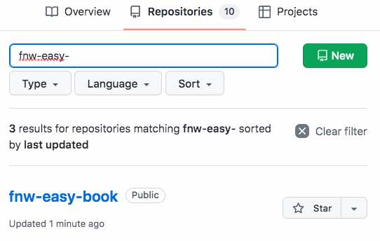
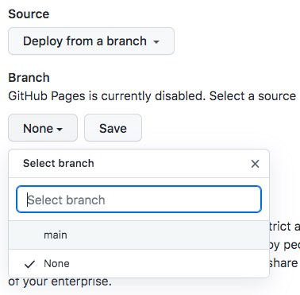

找到模板 repo 并 fork{.text-center}
---------------------------------

&nbsp;

### 模板项目

同一份 Fork and Write 工具，可能在 github 上提供多份模板，比方 [fnx-tools/fnw-easy-book](https://github.com/fnx-tools/fnw-easy-book) 是 EasyBook 的一份模板，其它模板也在 github 上以 repo 方式提供。

这些模板项目均已发布到 [GitHub Pages](https://pages.github.com/)，用户找到相应 repo 位置后，点击类似下图的 README 中 “跳至 GitHub Pages 主页了解详情” 链接，浏览器随即打开该项目发布到 GitHub Pages 所处的位置。

模板（电子书）发布后的界面将立即呈现。

&nbsp;

### 选择模板

先在网页打开 Federation Knowledge Sharing 在 github 的开源主页，切换到 repo 列表页，不妨 [点击链接](https://github.com/fnx-tools?tab=repositories)。然后在 `Find a repository` 搜索框输入 `fnw-`，当前 FNS 官方已提供的 Fork and Write 工具即被过滤出来，进一步输入 `fnw-easy-` 过滤范围将再收窄。

同类工具的的项目名，将以尾缀表达，比如 `fnw-easy-book, fnw-easy-book2, fnw-easy-book3` 都是 EasyBook 工具，不同模板会让最终产品的呈现界面稍显差异。用户可以选择一个合适的 repo，接下来将它 fork 到自己名下。

&nbsp;

### fork 模板项目

找到模板 repo 后，点击页面右上方的 Fork 按钮，将此项目 fork 到自己的空间下，在如下界面通常要改一下项目名称。

然后在 fork 后的项目主页，点击 Settings 按钮进入配置页面。

在配置页面的左边栏选择 Pages 项，然后在 Build and deployment 配置项下，指定将当前项目的哪个分支及哪个目录发布到 GitHub Pages 站点。

我们选择 `main` 分支，及 `/(root)` 根目录，之后点 Save 按钮。

上述操作不仅让用户复制一个 repo，还指定复制后的 repo 作为静态页托管到 `github.io` 站点。等 github 服务器构建 GitHub Pages 完成（通常小于 10 分钟），我们切换到目标 repo 的 README 主页，点击 “跳至 GitHub Pages 主页了解详情” 链接应能打开用户自己的电子书主页了。

